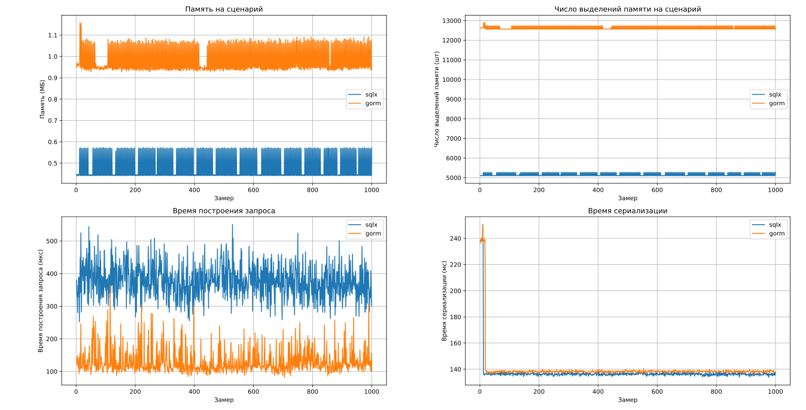
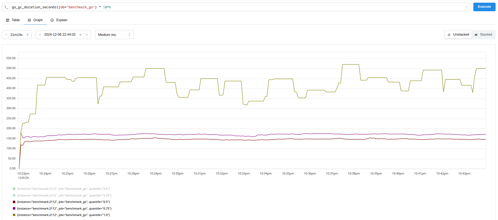

# Оценка производительности фреймворков БД

>
> Сравниваемые фреймворки
>
> sqlx + pgx
>
> gorm
>

## Результаты измерений

## Утилизация ресурсов

### CPU
#### SQLX

#### GORM

### DISK
#### SQLX

#### GORM

### GC stops
#### SQLX

#### GORM

### МБ на сценарий
#### SQLX

#### GORM

### МС на сценарий
#### SQLX

#### GORM

### Число выделений на сценарий
#### SQLX

#### GORM

