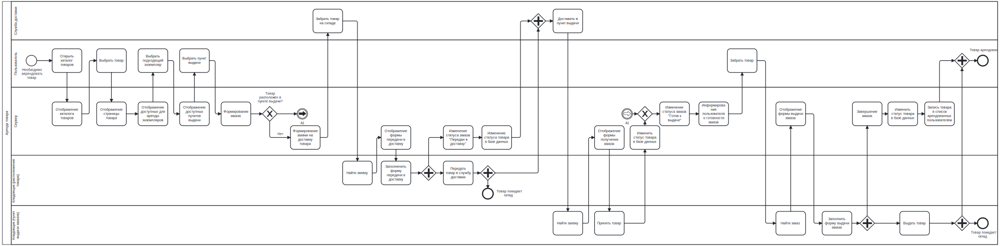
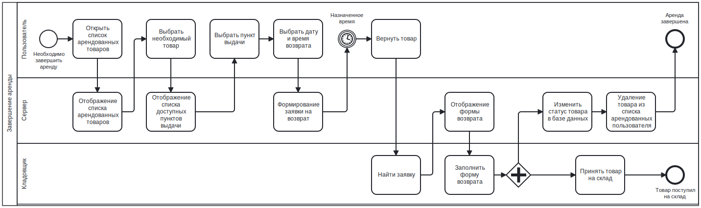
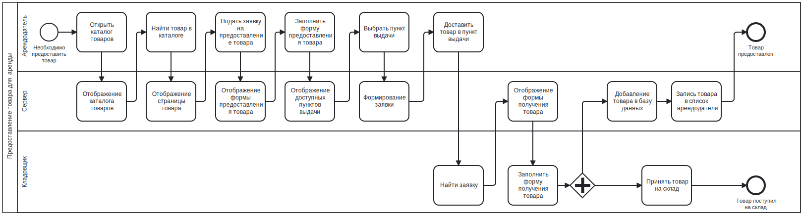
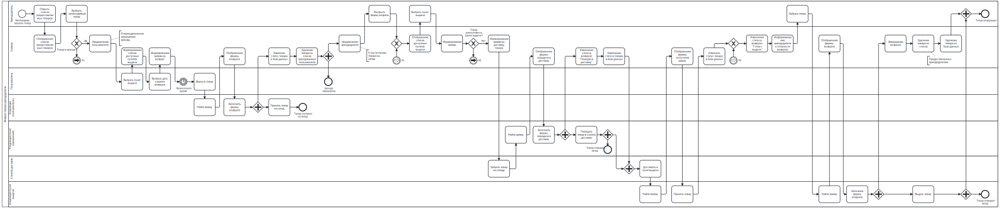

# Приложение по аренде товаров

## Цель работы, решаемая проблема / предоставляемая возможность

Целью работы является разработка веб сайта для ресурса по аренде товаров.
Приложение предоставляет возможность брать / сдавать проверенные предметы в
аренду по подписочной модели (дни / недели / месяцы).

## Краткий перечень функциональных требований

1. Просмотр каталога предоставляемых товаров.
1. Просмотр основной информации о товаре (описание).
1. Просмотр информации о конкретном товаре (состояние предоставляемого
   предмета, отзывы пользователей).
1. Подача заявки о предоставлении / получении / возврате товара.
1. Возможность выбора пункта выдачи для предоставления / получения / возврата
   товара.
1. Возможность оценить товар по окончании периода аренды.

## Use-case диаграмма системы

## BPMN диаграмма основных бизнес-процессов
### Аренда товара

### Завершение аренды товара

### Предоставление товара для аренды

### Возврат товара арендодателю

## Основные пользовательские сценарии
### Аренда товара
Пользователь:
1. раскрывает каталог товаров, выбрав соответствующий раздел сайта
   (раздел в заголовке);
1. выбирает необходимую категорию из открывшегося дерева;
1. настроив фильтры и сортировку, выбирает необходимый товар;
1. оценив характеристики и описание со страницы товара, выбирает доступный
   экземпляр из соответствующего списка ниже;
1. по завершении выбора, переходит в корзину, где выбирает:
    1. тарифный план для каждого товара;
    1. пункт выдачи;
1. после чего, нажимает кнопку "арендовать" и, при необходимости, ожидает
   доставку товара до выбранного ПВЗ;
1. дождавшись прибытия товаров, приходит в пункт выдачи товаров, где, после
   предъявления "кода подтверждения", получает заказ.

### Завершение аренды товара
Пользователь:
1. раскрывает список арендованных товаров, выбрав соответствующий раздел сайта
   (раздел в заголовке);
1. находит необзодимый товар в списке;
1. нажимает на кнопку "вернуть";
1. в открывшемся окне выбирает ПВЗ и дату завершения аренды;
1. дождавшись завершения времени аренды, приходит в ПВЗ, передает товар и
   называет код подтверждения.

### Предоставление товара для аренды
Арендодатель:
1. раскрывает список предоставленных товаров, выбрав соответствующий раздел
   сайта (раздел в заголовке);
1. нажимает на кнопку "предоставить"
1. в отрывшемся окне выбирает корневой товар:
    1. выбирается категория;
    1. выбирается товар;
1. заполняет описание и состояние товара;
1. заполняет тарифные планы;
1. выбирает доступный ПВЗ;
1. приходит в ПВЗ и передает товар на склад, назвав код подтверждения.

### Возврат товара арендодателю
Арендодатель:
1. раскрывает список предоставленных товаров, выбрав соответствующий раздел
   сайта (раздел в заголовке);
1. находит желаемый товар;
1. нажимает на кнопку "вернуть";
1. выбирает желаемый пункт выдачи;
1. дождавшись завершения аренды и доставки в ПВЗ, приходит и, назвав код
   подтверждения, получает товар.

## ER-диаграмма сущностей

## Диаграмма БД

## Компонентная диаграмма системы

## Экраны будущего web-приложения
### Главный экран

### Регистрация

### Каталог
#### Выбор категории

#### Выбор товара

### Страница товара

#### Отзывы

### Список аренд пользователя

>
> **Не отображенные состояния аренды:**
>
> _Арендодатель потребовал возврат:_ Необходимо выбрать пункт выдачи,
> отменить возврат нельзя
>
> _В доставке_
>
> _Готов к выдаче_: Также отображается код подтверждения
>

### Корзина

### Профиль

### Платежные данные

### Список предоставленных товаров

>
> **Не отображенные состояния аренды:**
>
> _В доставке_
>
> _Готов к выдаче_
>

### Управление складом
#### Список товаров на складе

#### Список заявок пользователей

#### Список заявок арендодателей

#### Список доставок

>
> **Не отображенные состояния доставки:**
>
> _Перемещение между пунктами выдачи_
>

